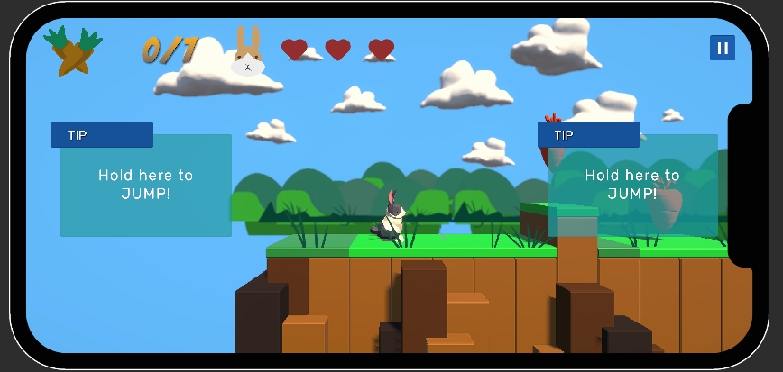
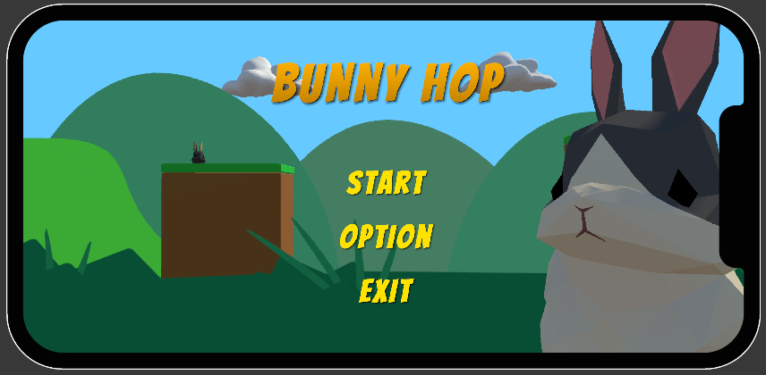

# 🕹️ Bunny Hop
> "Mi mascota escapó de casa, ayuda."

---

## 🎮 Descripción

**Bunny Hop** es un juego desarrollado por estudiantes de la UFG en **Unity 6000.0.38f1**. Juego 2.5D plataformero donde el
jugador controla a un conejo que debe cursar obstáculos hasta llegar a la meta al final de cada nivel, la cual es representada como una zanahoria dorada. Para lograr su objetivo, deberá esquivar espinas,
esquivar enemigos y encontrar todas las zanahorias de cada nivel.

---

## 📸 Capturas

| Gameplay | Menú Principal |
|---------|----------------|
|  |  |

---

## 🚀 Características

- ✅ Mecánica principal: Calculo de salto.  
- 🧠 Inteligencia artificial para enemigos.
- 📈 Juego instantáneo de progresión rápida.
- ⚔️ Oxes.

---

## 🧩 Requisitos

- Unity **6000.0.38f1** o superior  
- .NET Framework 4.x  
- Windows
- GPU compatible con **gráficos 2D básicos** (DX9+ suficiente)

---

## 🔧 Instalación

1. Clona el repositorio  
   ```bash
   git clone https://github.com/ia-MarvinRios/BunnyGameProject.git
